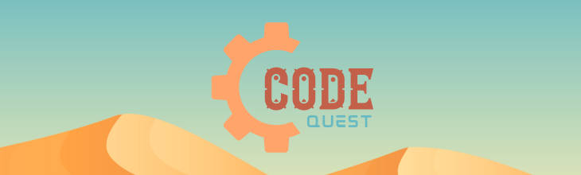

# Code Quest

Level up your code with **Code Quest**!

[Try](https://code-quest-app.netlify.app/) • [GitHub](https://github.com/rioredwards/code-quest)

This immersive web app generates pseudo-random coding challenges, making learning practical coding skills **exciting** and **engaging**!

## Made with

&nbsp;&nbsp;&nbsp;&nbsp;&nbsp;&nbsp;&nbsp;

## Features

* **Choose Your Own Adventure**: Users can have quests generated completely at random, or they may specify certain parameters, such as the time limit, and the programming language.
* **Realistic Challenges**: Code Quest will never create a quest that doesn't make sense (e.g. CLI quest using React). A sophisticated algorithm ensures that any quest generated is feasible.
* **Intuitive UI**: The UI was designed to resemble a slot machine, giving the app a familiar feel and making it easy to get started. If you do get stuck, there is a built-in help menu to explain the various features.
* **Smooth Animations**: This app makes heavy use of the Framer Motion animation library, which brings the UI to life!
* **Custom Artwork**: All artwork is custom-made, giving Code Quest a unique look and feel.

## Preview

## Usage

1. Pull the lever to start.
2. Click on the stop buttons to stop the reels.
3. Once all the reels have stopped, your quest will be printed out on the display panel.
4. Get coding!

## Configure

To get more control over the quest generated:

1. Click and drag the reels up and down to select a choice.
2. Lock in your choice by clicking the lock switch.
3. Generate a quest as normal.

\* If you get stuck, click the help button for more information.

## Lessons learned

* **Best Practices** for designing and building advanced, UI's in React.
* **Complex Animations** using the Framer Motion Animation Library.
* Employing **Typescript** to create **type-safe** and **scalable** applications.
* Complex state management using **Redux**.
* Designing highly reusable **React components**.
* Designing and integrating custom SVG artwork using **Adobe Illustrator**.
* Utilizing **Figma** to create high-fidelity mockups.
* Creating eye-catching brand assets using **Canva**.
* Practicing standard **git and GitHub** workflows to safely and efficiently manage code.
* Deploying to **Netlify**.

## Reflection

Since I started on my coding journey, I've always been drawn to learning tools that use [Gamification](https://en.wikipedia.org/wiki/Gamification) in some form to teach coding concepts ([some examples](https://github.com/rioredwards/code-quest#gamification-examples)). I find that I learn best when I'm having fun, and I wanted to create a tool that would help others learn in the same way.

This was the first time since attending a coding boot camp that I've gotten to focus as much on the design and UI of an application as the technical "business logic". I have a love for design and art, so it was really fun to get to flex those muscles again.

It was also the first time I used Framer Motion. This library is really powerful and I enjoyed diving into it. Getting a convincing "Infinite Scroll" effect on the reels was pretty tricky, but in that process, I learned about some of the more advanced features of Framer Motion and gained a deeper understanding of creating animations in code, more generally.

I also gained an appreciation for the process of creating "proof-of-concepts" before attempting to implement certain features into a project. I tried to predict what the most challenging aspects of creating this app might be and created prototypes in a throwaway file or code sandbox. This saved me a lot of time and frustration in the long run.

I had a lot of fun working on this project, and I'm excited to continue learning and improving my skills. ✅

## Authors

* [Rio Edwards](https://www.github.com/rioredwards)

## Acknowledgements

* [readme.so](https://readme.so/editor)
* [Simple Icons](https://simpleicons.org/?q=redux)
* [shields.io](https://shields.io/)

## Gamification Examples

* [Flexbox Froggy](https://flexboxfroggy.com/)
* [Grid Garden](https://cssgridgarden.com/)
* [LeetCode](https://leetcode.com/)
* [kaggle](https://www.kaggle.com/competitions/)
* [Vim Adventures](https://vim-adventures.com/)

